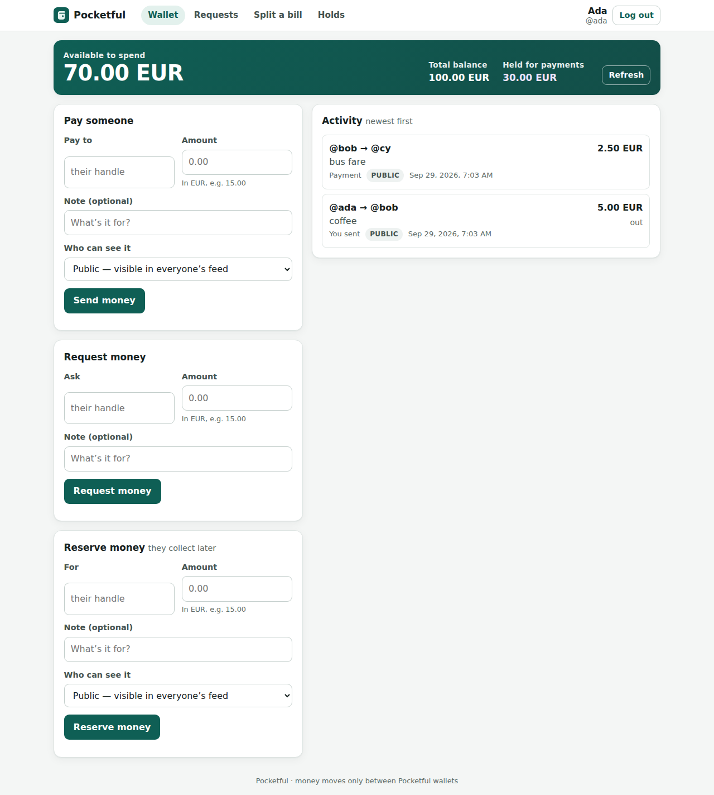

# Cuatro asientos, y el servicio de pagos que construyeron

*[Read in English](README.md)*

**Track:** Pocketful · **Equipo:** four-seats · **Licencia:** MIT

Cuatro asientos de agente en una sala de BAND Desktop: un **analyst** que convierte la
especificación en obligaciones numeradas, un **implementer** que construye, un **adversary** que
intenta refutar lo construido, y un **auditor** que reproduce la evidencia antes de que se acepte
nada. Ningún asiento acepta su propio trabajo.

**En esta sala existe un solo mensaje humano.** Autorizó los cuatro stages y no dijo nada más. Cada
stage posterior al primero lo abrió el propio analyst, sin intervención humana.

## Qué hay aquí

| | |
|---|---|
| Stages | **4 de 4**, cada uno congelado y aceptado por el auditor |
| Harness público, `--all --mode isolated`, desde un clon nuevo | cada carpeta reclama su stage con **el 100% de sus checks públicos**; los stages 1 a 3 fallan la suite siguiente, como deben |
| Candidatos rechazados | **2**, con **3 hallazgos** —dos del adversary, uno del auditor—, todos reparados y reauditados dentro de la tirada |
| Tiempo de pared | **4 h 14 min**, del despacho al informe final |
| Gasto en modelo | **~136 $**, estimado a precios de catálogo; no es una factura |

Las cifras del harness son los checks **públicos** del kickoff. Son una parte de lo que se aplica
antes de juzgar, y no afirmamos nada sobre la evaluación oculta.

Uno de esos rechazos es la razón por la que merece la pena leer este repositorio. Sobre un candidato
del stage 3 el harness oficial lo pasó todo —147 + 35 + 6 checks en modo aislado, cero omitidos, más
150/150 de regresión y 14/14 de migraciones— y el auditor lo rechazó igualmente, porque su propia
sonda hizo que el servicio **se cayera con un desbordamiento de heap tras 4.761 lecturas de
extracto** y perdiera todo el estado. Tras la reparación, 20.000 lecturas devolvieron 200 y el
contenedor se quedó en 39,7 MiB. `FACTORY.es.md` cuenta los tres hallazgos enteros.

## Qué construyó

Un servicio de monedero: la gente se envía dinero por handle, lo pide de vuelta, divide cuentas,
reserva dinero para que otro lo cobre más tarde, consulta su saldo en cualquier instante pasado,
corrige pagos sin reescribir la historia y los reembolsa. Un solo proceso Node.js, sin dependencias, y
cada importe un entero exacto.



*Una captura real de `stage-4/` sembrado con [`seed.json`](seed.json): disponible, total y retenido
por separado, y el feed de actividad.* Más en [`docs/product/`](docs/product/), en inglés:
[`FEATURES.md`](docs/product/FEATURES.md) con lo que añadió cada stage, pantallas y peticiones reales
del stage 4, y [`ARCHITECTURE.md`](docs/product/ARCHITECTURE.md) con cómo está construido.

## Mapa

- **`FACTORY.es.md`** — el diseño, los resultados medidos, los dos rechazos, lo que costó y lo que le
  diríamos al siguiente equipo. Empieza por ahí.
- [`docs/product/`](docs/product/) — el servicio en sí: arquitectura, funcionalidades por stage y
  capturas. Escrito después de la tirada a partir del código aceptado.
- **[`EVIDENCE-INDEX.md`](EVIDENCE-INDEX.md)** — cada afirmación de este README, con el fichero que la
  respalda y el comando que la reproduce (en inglés).
- **[`RUNBOOK.es.md`](RUNBOOK.es.md)** y `setup/` — cómo volver a levantar la fábrica y apuntarla a
  otro problema.
- `mandates/` — las cuatro instrucciones permanentes. El cuerpo de cada una es el texto que se cargó en
  su asiento; las líneas de cabecera `Harness` / `Model` se normalizaron después al ID exacto que
  registraron los asientos (`claude-opus-5-5`, ver la decisión D-17). Lee una entera: en ningún
  momento dice cuál es el producto.
- `stage-1/` … `stage-4/` — un servicio autónomo por stage. Cada uno se construye y arranca solo,
  sin depender de los demás.
- `verification/adversary/stage-N/` — las suites propias del adversary, versionadas y separadas del
  código de producción.
- `evidence/runs/fskit-001/` — el registro: obligaciones, handoffs, veredictos, tiradas del harness
  e informes de migración. Cada afirmación enlaza una obligación, una revisión de producto, una
  revisión de tests, un comando y un resultado real.
- `room.json` — la sesión completa exportada de BAND. El único mensaje humano es `3f95ab60`. Se
  redactaron cuatro leases de receptor; [`REDACTION.md`](REDACTION.md) deja constancia de qué y prueba
  que nada más cambió.

## Cómo ejecutarlo

Cada carpeta de stage trae su `RUN.md` y se construye en un solo comando, sin red en tiempo de
ejecución. Para comprobar un stage contra el harness oficial, desde el checkout del kickoff:

```
python -m harness run --track pocketful --repo <este repo> --stage 1 --mode isolated --out <dir nuevo>
```

`--stage 2`, `3` y `4` hacen lo mismo con las carpetas posteriores, y `--all` verifica la cadena
entera. Los stages 2 a 4 sirven una interfaz de navegador; el harness la recorre a 375 px y 1280 px.

Para probar el producto a mano:

```
cd stage-4
docker build -t pocketful-stage-4 . && docker run --rm -p 8080:8080 pocketful-stage-4
curl -X POST http://127.0.0.1:8080/_test/reset -H "Content-Type: application/json" --data-binary @../seed.json
```

Luego abre <http://127.0.0.1:8080/login> y entra como `ada@example.com`, `bob@example.com` o
`cy@example.com`, todos con la contraseña `correct horse`. El estado vive en memoria, como permite la
especificación: un reinicio lo vacía, y el mismo `curl` lo restaura.

## Licencia

Todo el repositorio, carpetas de stage incluidas, está bajo la licencia MIT de [`LICENSE`](LICENSE).
El implementer escribió el `package.json` de cada stage con `"private": true` y
`"license": "UNLICENSED"`, los metadatos de npm para un paquete que no se va a publicar. Ese campo no
es la licencia de este repositorio. No lo tocamos porque editarlo cambiaría árboles de producto que
el auditor ya había aceptado, y una edición humana sobre trabajo aceptado es justo lo que esta tirada
evitó. Si parecen contradecirse, manda el `LICENSE` de la raíz.

## Lo que no afirmamos

Tres hallazgos no son muchos, y desde dentro de la tirada no podemos saber si un cuarto se coló entre
los cuatro filtros. Una tirada es un solo dato. El auditor reproduce, pero no hace
pruebas de mutación: un check que pasara contra código roto a propósito seguiría pareciendo correcto
aquí. Las cifras de coste son estimaciones a partir de recuentos de tokens, no una factura.
`FACTORY.es.md` dice todo esto con más detalle, porque una fábrica que esconde sus límites no es una
que nadie vaya a reutilizar.
