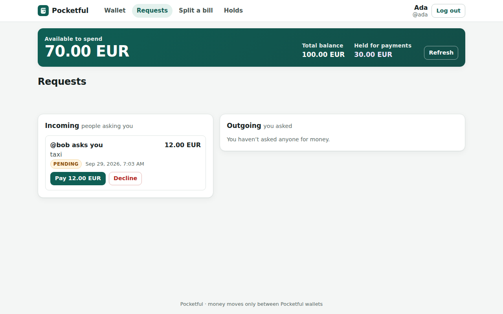
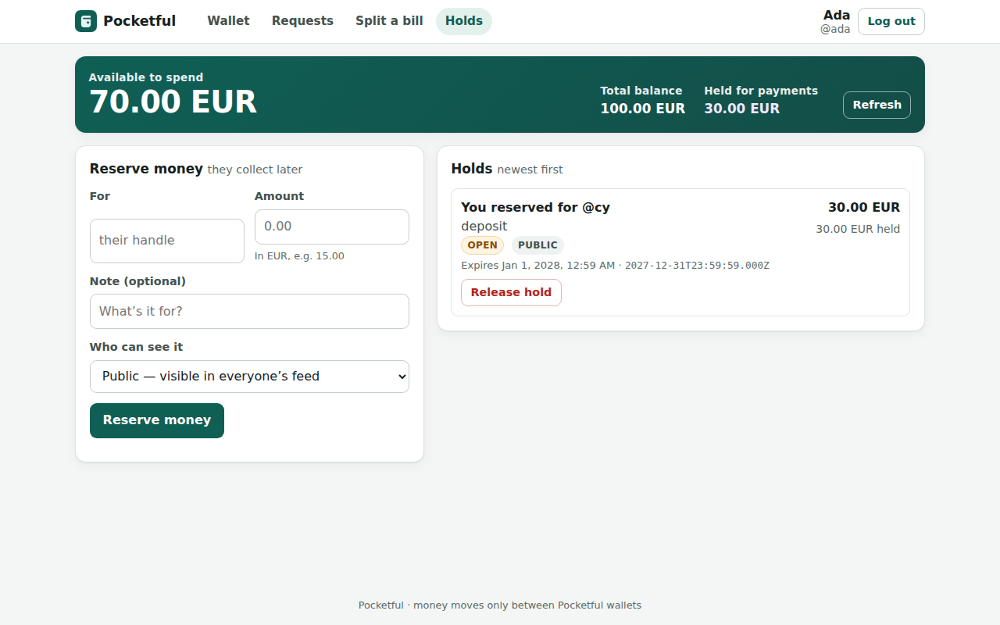
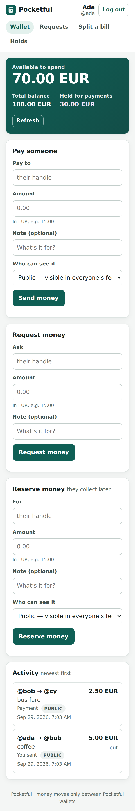

# What the service does, stage by stage

> Written by the operator **after** the run, from the accepted code, each stage's own `RUN.md`, and
> requests made against a live `stage-4/` container seeded with the repository's
> [`seed.json`](../../seed.json). The screenshots and the request/response examples below are real
> captures from that container, not mock-ups. This is not output of the band, and nothing here
> changed the product.

The service is **Pocketful**, a wallet app: people send each other money by handle, ask for it back,
split bills, and reserve money to be collected later. Each stage extends the previous one and every
earlier behaviour keeps working — the route tables only ever grow, 16 → 25 → 28 → 30, and no route
was ever removed.

For how it is built, see [`ARCHITECTURE.md`](ARCHITECTURE.md).

## Stage 1 — wallets, payments, requests, splits, settlements

> *A JSON HTTP service for wallets, payments, payment requests, bill splits and atomic net
> settlements.* — `stage-1/RUN.md`

| | |
|---|---|
| Accounts | `POST /auth/signup`, `POST /auth/login`, `GET /me` |
| Payments | `POST /payments`, by handle, with per-user idempotency and a public or private feed |
| Requests | `POST /requests`, `GET /requests`, and `pay`, `decline`, `cancel` on each one |
| Splits | `POST /splits` — one amount across several people, remainder cents assigned in a fixed order |
| Settlements | `POST /settlements` — net several debts in one atomic operation |
| Activity | `GET /activity`, the feed a user is allowed to see |
| Test hooks | `GET /health`, `POST /_test/reset`, `GET /_test/export`, `POST /_test/import` |

Public checks passed by `stage-1/`: **147/147**.

## Stage 2 — the browser, and money held for later

> *Wallet screens in the browser, plus the stage-1 JSON API extended with payment authorizations
> (holds), captures, voids and expiry.* — `stage-2/RUN.md`

| | |
|---|---|
| Screens | `/`, `/login`, `/signup`, `/split`, and `/requests`, `/authorizations` served as HTML or JSON by `Accept` |
| Holds | `POST /authorizations`, `GET /authorizations`, then `capture` (partial or final) and `void` |
| Balances | `/me` now separates `balance`, `available` and `held` |

Public checks passed by `stage-2/`: **147/147 + 35/35**, with the UI exercised at 375 px and 1280 px.

## Stage 3 — history

> *…extended with historical balances, paginated statements with snapshot tokens, and payment
> corrections with an immutable revision history.* — `stage-3/RUN.md`

| | |
|---|---|
| Corrections | `POST /payments/{id}/corrections` — a new revision, never an edit, with `expected_revision` |
| Revisions | `GET /payments/{id}/revisions` |
| Statements | `GET /statement` — paginated, with a snapshot token so later pages see the same view |
| Time travel | balances and statements `as_of` an instant and as `known_at` an instant |

Public checks passed by `stage-3/`: **147/147 + 35/35 + 6/6**.

## Stage 4 — refunds and correction batches

> *…extended with refunds and operator correction batches.* — `stage-4/RUN.md`

| | |
|---|---|
| Refunds | `POST /payments/{id}/refunds` — the receiver returns part or all of a payment |
| Batches | `POST /correction-batches` — a settlement operator corrects up to 32 payments atomically |

Public checks passed by `stage-4/`: **147/147 + 35/35 + 6/6 + 5/5**.

Stage 4 adds no screens; the specification adds these operations to the API. They are shown below as
real requests.

## Screens

All four screens are signed in as Ada, from `seed.json`: she has 100.00 EUR, of which 30.00 EUR is
held for Cy, and Bob has asked her for 12.00 EUR.

**The wallet.** Available to spend, total and held, shown apart. Pay, request and reserve on the
left; the activity feed on the right.


**Requests.** Bob's request for the taxi, pending, with pay and decline.



**Holds.** The 30.00 EUR reserved for Cy, open, with its expiry shown both in local time and as the
exact instant.



**On a phone.** The same wallet at 375 px: one column, nothing cut off.



Also captured: [sign-in](screenshots/login-desktop.png), [split a bill](screenshots/split-desktop.png),
and every screen at 375 px — [requests](screenshots/requests-mobile.png),
[holds](screenshots/authorizations-mobile.png), [split](screenshots/split-mobile.png).

## Stage 4 by request

Run in this order against a freshly seeded container. Tokens are elided; everything else is the
verbatim response.

### 1. Ada pays Bob 10.00

An ordinary payment. The response is the receipt.

```http
POST /payments
Authorization: Bearer <token>
Idempotency-Key: demo-pay-1

{
  "to_handle": "bob",
  "amount": 1000,
  "note": "dinner",
  "visibility": "public"
}
```

`201`

```json
{
  "payment_id": "p_I61ruh8gdGPmCJwD",
  "from_user_id": "u_ada",
  "from_handle": "ada",
  "to_user_id": "u_bob",
  "to_handle": "bob",
  "amount": 1000,
  "currency": "EUR",
  "note": "dinner",
  "visibility": "public",
  "request_id": null,
  "settlement_id": null,
  "authorization_id": null,
  "refund_of": null,
  "created_at": "2026-09-29T05:05:03.577+00:00"
}
```

### 2. The same request, retried with the same key

Same `Idempotency-Key`, same body: the **original receipt** comes back with `200`, and no money moves a second time.

```http
POST /payments
Authorization: Bearer <token>
Idempotency-Key: demo-pay-1

{
  "to_handle": "bob",
  "amount": 1000,
  "note": "dinner",
  "visibility": "public"
}
```

`200`

```json
{
  "payment_id": "p_I61ruh8gdGPmCJwD",
  "from_user_id": "u_ada",
  "from_handle": "ada",
  "to_user_id": "u_bob",
  "to_handle": "bob",
  "amount": 1000,
  "currency": "EUR",
  "note": "dinner",
  "visibility": "public",
  "request_id": null,
  "settlement_id": null,
  "authorization_id": null,
  "refund_of": null,
  "created_at": "2026-09-29T05:05:03.577+00:00"
}
```

### 3. Bob refunds 3.00 of it

Only the receiver may refund. The refund is a new payment back to Ada, linked by `refund_of`.

```http
POST /payments/p_I61ruh8gdGPmCJwD/refunds
Authorization: Bearer <token>
Idempotency-Key: demo-refund-1

{
  "amount": 300
}
```

`201`

```json
{
  "payment_id": "p_yVbQYRCH7s1_q4iE",
  "from_user_id": "u_bob",
  "from_handle": "bob",
  "to_user_id": "u_ada",
  "to_handle": "ada",
  "amount": 300,
  "currency": "EUR",
  "note": "dinner",
  "visibility": "public",
  "request_id": null,
  "settlement_id": null,
  "authorization_id": null,
  "refund_of": "p_I61ruh8gdGPmCJwD",
  "created_at": "2026-09-29T05:05:03.582+00:00"
}
```

### 4. Bob tries to refund 8.00 more — only 7.00 is left

3.00 of the 10.00 is already refunded, so at most 7.00 remains. The service refuses rather than overdraw the payment.

```http
POST /payments/p_I61ruh8gdGPmCJwD/refunds
Authorization: Bearer <token>
Idempotency-Key: demo-refund-2

{
  "amount": 800
}
```

`422`

```json
{
  "error": {
    "code": "refund_exceeds_payment",
    "message": "refunds would exceed the payment's current amount"
  }
}
```

### 5. Ada, a settlement operator, corrects the seeded coffee from 5.00 to 4.00 in one batch

Ada is a settlement operator in the seed. The batch is atomic, and the correction is a **new revision**, not an edit.

```http
POST /correction-batches
Authorization: Bearer <token>
Idempotency-Key: demo-batch-1

{
  "corrections": [
    {
      "payment_id": "p_1",
      "expected_revision": 1,
      "amount": 400,
      "effective_at": "2026-09-29T05:05:03.544+00:00",
      "reason": "price adjusted"
    }
  ]
}
```

`201`

```json
{
  "correction_batch_id": "cb_stsO7Tpwepv7FLEa",
  "recorded_at": "2026-09-29T05:05:03.590+00:00",
  "revisions": [
    {
      "payment_id": "p_1",
      "revision": 2,
      "amount": 400,
      "effective_at": "2026-09-29T05:05:03.544+00:00",
      "recorded_at": "2026-09-29T05:05:03.590+00:00",
      "reason": "price adjusted",
      "correction_batch_id": "cb_stsO7Tpwepv7FLEa"
    }
  ]
}
```

### 6. The coffee now has two immutable revisions

Revision 1 is untouched. Revision 2 records when it was learned (`recorded_at`) apart from when it applies (`effective_at`).

```http
GET /payments/p_1/revisions
Authorization: Bearer <token>
```

`200`

```json
{
  "revisions": [
    {
      "payment_id": "p_1",
      "revision": 1,
      "amount": 500,
      "effective_at": "2026-09-29T05:05:03.544+00:00",
      "recorded_at": "2026-09-29T05:05:03.544+00:00",
      "reason": "",
      "correction_batch_id": null
    },
    {
      "payment_id": "p_1",
      "revision": 2,
      "amount": 400,
      "effective_at": "2026-09-29T05:05:03.544+00:00",
      "recorded_at": "2026-09-29T05:05:03.590+00:00",
      "reason": "price adjusted",
      "correction_batch_id": "cb_stsO7Tpwepv7FLEa"
    }
  ]
}
```

### 7. Ada's statement, first page, with a snapshot token

The statement already reflects the corrected coffee. The `snapshot` token pins this view for later pages.

```http
GET /statement?limit=3
Authorization: Bearer <token>
```

`200`

```json
{
  "opening_balance": 10500,
  "entries": [
    {
      "payment": {
        "payment_id": "p_1",
        "from_user_id": "u_ada",
        "from_handle": "ada",
        "to_user_id": "u_bob",
        "to_handle": "bob",
        "amount": 400,
        "currency": "EUR",
        "note": "coffee",
        "visibility": "public",
        "request_id": null,
        "settlement_id": null,
        "authorization_id": null,
        "refund_of": null,
        "created_at": "2026-09-29T05:05:03.544+00:00"
      },
      "delta": -400,
      "balance_after": 10100,
      "revision": 2,
      "effective_at": "2026-09-29T05:05:03.544+00:00",
      "recorded_at": "2026-09-29T05:05:03.590+00:00"
    },
    {
      "payment": {
        "payment_id": "p_I61ruh8gdGPmCJwD",
        "from_user_id": "u_ada",
        "from_handle": "ada",
        "to_user_id": "u_bob",
        "to_handle": "bob",
        "amount": 1000,
        "currency": "EUR",
        "note": "dinner",
        "visibility": "public",
        "request_id": null,
        "settlement_id": null,
        "authorization_id": null,
        "refund_of": null,
        "created_at": "2026-09-29T05:05:03.577+00:00"
      },
      "delta": -1000,
      "balance_after": 9100,
      "revision": 1,
      "effective_at": "2026-09-29T05:05:03.577+00:00",
      "recorded_at": "2026-09-29T05:05:03.577+00:00"
    },
    {
      "payment": {
        "payment_id": "p_yVbQYRCH7s1_q4iE",
        "from_user_id": "u_bob",
        "from_handle": "bob",
        "to_user_id": "u_ada",
        "to_handle": "ada",
        "amount": 300,
        "currency": "EUR",
        "note": "dinner",
        "visibility": "public",
        "request_id": null,
        "settlement_id": null,
        "authorization_id": null,
        "refund_of": "p_I61ruh8gdGPmCJwD",
        "created_at": "2026-09-29T05:05:03.582+00:00"
      },
      "delta": 300,
      "balance_after": 9400,
      "revision": 1,
      "effective_at": "2026-09-29T05:05:03.582+00:00",
      "recorded_at": "2026-09-29T05:05:03.582+00:00"
    }
  ],
  "closing_balance": 9400,
  "has_more": false,
  "snapshot": "st_LKHZCk5ZywlnFV6A51MpyJH2"
}
```


## Reproduce these

Against the live demo at <https://four-seats-factory.onrender.com>, seeded with the same
`seed.json`, or locally:

```
cd stage-4
docker build -t pocketful-stage-4 . && docker run --rm -p 8080:8080 pocketful-stage-4
curl -X POST http://127.0.0.1:8080/_test/reset -H "Content-Type: application/json" --data-binary @../seed.json
```

Then sign in at <http://127.0.0.1:8080/login> as `ada@example.com` / `correct horse`, or send the
requests above with the token from `POST /auth/login`.

The service logs `pocketful stage-1 listening on …` even when it is `stage-4/`. That string was written
in stage 1 and each stage copied the code forward unchanged; it is not a sign that the wrong folder
was deployed, and it was left as is because editing it would change an accepted product tree.
